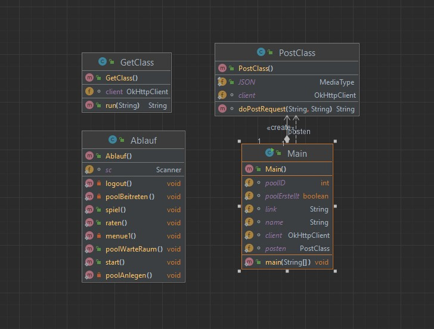

# hangmanClient

Autoren:

- Sophia Berg
- Tuhin Thodeme
- Luisa Victor

Projektbeschreibung:

Dieses Projekt wurde im Rahmen der Vorlesung "Praktikum: Objektorientierte Softwareentwicklung" der Universität Bonn erstellt.
Bei diesem Projekt handelt es sich um den Client, der mit einem Spieleserver  für das Spiel "Hangman" kommuniziert.
Hier werden alle Requests des Clients auf Basis der Nutzereingaben erstellt und losgeschickt. Abhängig von der Antwort werden dem Nutzer weitere Handlungsschritte vorgeschlagen oder das Spiel beendet.
Die Klasse AblaufIntern weist Methoden auf, die wie Zustände eines Automaten durchlaufen werden. So ist etwa die Methode menue1() Ausgangspunkt vieler Szenarien. Die Anwendung wird durch den Aufruf der start()-Methode in der Klasse Main gestartet.

Spielregeln:

- Zu einem Spiel gehören 2 Spieler 
- je nach gewähltem Schwierigkeitsgrad hat jeder Spieler ein bestimmte Anzahl an Leben:
   --> Level 1: 20 Leben
   --> Level 2: 15 Leben
   --> Level 3: 10 Leben
   --> Level 4: 5 Leben

- Ablauf des Spiels: 
- --> ein Spieler kann einen Pool eröffnen mit einem vordefinierten Schwierigkeitsgrad. Andere User können dann einem Pool beitreten
und mitspielen
  --> bei jedem Spiel wird aus einem gespeicherten Pool aus Wörtern eines zufällig ausgewählt und die Anzahl an Buchstaben den beiden Spielern mitgeteilt
  --> beide Spieler wechseln sich immer ab mit dem Erraten eines Buchstabens oder eines ganzen Wortes
  --> der Spieler, der sein Wort errät und noch am meisten Leben hat gewinnt
  --> wenn beide verlieren (alle Leben verbraucht) gewinnt niemand
  --> wenn man ein ganzes Wort erraten möchte und die Anwort falsch werden 2 Leben abgezogen
  --> Ende des Spiels:
             - ein Spieler errät das richtige Wort und hat noch mehr als 0 Leben
             - beide Spieler erraten das Wort nicht und haben keine Leben mehr

UML Diagram Client:

Menue-Diagramm Client:

API-Pfade

Verwendete Features:
Http-Client: okhttp3

